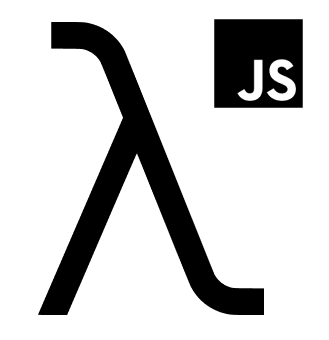

# Lambda Kalkül für praktisches JavaScript

  
  

### Was ist Lambda Kalkül?

**Lambda Kalkül** ist ein formales System, in der mathematische Logik zur Berechnung und Untersuchung von Funktionen gilt.  Es ist ein universelles Berechnungsmodel , mit dem jede Turing-Maschine simuliert werden kann. Es wurde von dem Mathematiker [Alonzo Church](https://en.wikipedia.org/wiki/Alonzo_Church) in den 1930er Jahren als Teil seiner Forschung zu den Grundlagen der Mathematik eingeführt.


Lambda-Kalkül hat im Grunde nichts in sich. Es hat nur drei Dinge: Variablen, einen Weg, Funktionen zu bauen und einen Weg, Funktionen anzuwenden. Es hat keine anderen Kontrollstrukturen, keine anderen Datentypen, gar nichts.


### Was ist JavaScript?

JavaScript ist die Programmiersprache die hauptsächlich im Web verwendet wird und durch den Browser ausgeführt wird. JavaScript integriert dabei viele funktionale Aspekte, stellt aber auch einiges an Funktionalität aus der objektorientierten Programmierung zur Verfügung. Es besteht also die Möglichkeit, in vielen verschiedenen Paradigmen zu programmieren.

### Lambda Kalkül & JavaScript

Das Konzept ist, Lambda Kalkül mit der Programmiersprache JavaScript zu verbinden. Das heisst, in nur rein funktionalen Paradigma Program-Codes zu schreiben \(purely functional\) und JavaScript bietet Sprachelemente wie Closures und Funktionen, die für die funktionale Programmierung erforderlich sind. Sie machen es möglich, das wir in JavaScript funktional programmieren können und die Konzepte der Seiteneffektfreiheit, Zustandslosigkeit, Variablenbindung statt Zuweisung, Funktionskomposition und Funktionen höherer Ordnung \(high order functions\) gewährleistet werden können.

## Forschungsarbeit

Ziel der Arbeit ist es, neue Konstruktionen aus dem untypisierten Lambda Kalkül, mit der Programmiersprache JavaScript zu bauen. Diese Konstruktionen haben das Ziel, JavaScript Applikationen robuster, sicherer und wartbarer zu machen. Bei diesen Konstruktionen setzen wir komplett auf die Werte der funktionalen Programmierung:

* **Purity** \(_pure functions\):_   Funktionen ohne Seiteneffekte \(wie mathematische Funktionen\)
* **Immutabilty** \(_immutable Datastructure\):_  Unveränderliche Datenstrukturen
* **Iteration** : Eine Iteration ohne Ausdrücke wie _`for`_, _`while`_ oder `do` Schleifen

> Es werden keine Objektorientierte- oder sonstige nicht funktionale Konzepte verwende.

## Inhaltsverzeichnis

* [Forschungsarbeit IP5 - Lambda Kalkül mit JavaScript](https://mattwolf-corporation.gitbook.io/ip5-lambda-calculus/forschungsarbeit-ip5-lambda-kalkuel)
  * [Einfache Kombinatoren](https://mattwolf-corporation.gitbook.io/ip5-lambda-calculus/forschungsarbeit-ip5-lambda-kalkuel/einfache-kombinatoren)
  * [Church Encodings - Booleans und Zahlen](https://mattwolf-corporation.gitbook.io/ip5-lambda-calculus/forschungsarbeit-ip5-lambda-kalkuel/church-encodings-zahlen-und-boolesche-werte)
  * [Der lambdafizierter Taschenrechner](https://mattwolf-corporation.gitbook.io/ip5-lambda-calculus/forschungsarbeit-ip5-lambda-kalkuel/der-lambdafizierter-taschenrechner)
  * [Immutable Stack](https://mattwolf-corporation.gitbook.io/ip5-lambda-calculus/forschungsarbeit-ip5-lambda-kalkuel/immutable-stack)
  * [Test-Framework](https://mattwolf-corporation.gitbook.io/ip5-lambda-calculus/forschungsarbeit-ip5-lambda-kalkuel/test-framework)

* Forschungsarbeit IP6 - Fortschrittliche Abstraktionen im Lambda Kalkül mit JavaScript
  * ListMap
  * Observable-ListMap
  * Maybe

Eine Forschungsarbeit: Projekt \(IP5\) und Bacherlorarbeit \(IP6\) von  
  
                                  **Benjamin Brodwolf**          &        **Pascal Andermatt**  
                                            [GitHub](http://github.com/BenjaminBrodwolf)                                         [GitHub](https://github.com/PascalAndermatt)

Einen besonderes Dankschön an unseren Projektbetreuer, Auftraggeber, Supporter und Inspirator:  
[**Prof. Dierk König**](https://dierk.github.io/Home/)\*\*\*\*

