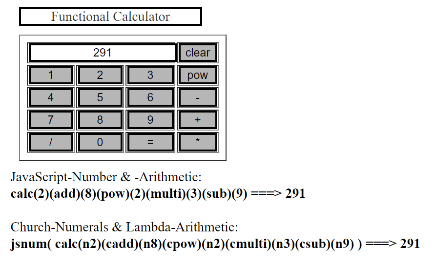

# Der lambdafizierter Taschenrechner

Für ein Einstieg-Projekt, um sich am beste einmal mit den [Kombinatoren](einfache-kombinatoren.md) und den [Church-Zahlen](church-encodings-zahlen-und-boolesche-werte.md) auseinander zusetzen, haben wir uns für einen Taschenrechner entschieden.

## Beschreibung

Die Idee war einen Taschenrechner so zu bauen, der möglichst leicht zu bedienen, und verständlich aufgebaut, ist. Um dies zu erreichen sollte eine einfache Verkettung der arithmetischen Zahlen und Operationen möglich sein. Dafür wurde eine sogenannter _CalculatorHandler_ entwickelt, welche jeweils eine arithmetische Operation \(Addition, Subtraktion, Multiplikation usw.\), zwei Werte und zum Schluss eine Funktion entgegen nimmt.

CaluclatorHandler Implementation:

```javascript
const calculatorHandler = op => n => k => f => f(op(n)(k));
```

### 

## Rechnen mit JavaScript-Zahlen

Mit den einfachen JavaScript-Operatoren \(  `plus = x => y => x + y`   `substraction = x => y => x - y` etc. \) und dem _CalculatorHandler_ können Berechnungen durchgeführt werden, jedoch unspektakulärer und nicht einfacher bedienbarer, als wenn die JavaScript-Operatoren direkt benutzt würde:

### **Einfach Addition mit JavaScript-Operatoren:**

```javascript
 plus(1)(2)            // 3
 plus(1)( plus(2)(3) ) // 6 
```

### **Addition mit JavaScript-Operator und dem** _**CalculatorHandler**_**:**

```javascript
calculatorHandler(plus)(1)(2)(id)                                   // 3
calculatorHandler(plus)(1)( calculatorHandler(plus)(1)(2)(id) )(id) // 6
```

Wenn aber neue Funktionen  via Point-Freestyle mit dem _CalculatorHandler_ und den JavaScript-Operatoren __erstellt werden... 

```javascript
const add   = calculatorHandler(plus);            
const multi = calculatorHandler(multiplication);  
const sub   = calculatorHandler(subtraction);
const pow   = calculatorHandler(exponentiation);
const div   = calculatorHandler(division);
```

... und die [Thrush-Funktion](einfache-kombinatoren.md) `T = x => f => f(x)`  als den Taschenrechner-Starter verwendet, kann eine unendliche Verkettungen von Zahlen und Operationen erstellt werden.

Beispiel:

```javascript
T(1)(add)(2)(pow)(6)(sub)(2)(div)(8)(add)(7)(multi)(4)(sub)...
```

Um diese Verkettung jedoch abzubrechen und das Resultat der Berechnung zu erhalten, braucht man jeglich die [Identity-Funktion](einfache-kombinatoren.md) `id = x => x`  als Letztes anzuwenden.

Beispiel:

```javascript
T(1)(add)(2)(id)                     //   3
T(1)(sub)(2)(id)                     //  -1
T(5)(multi)(4)(add)(2)(id)           //  22
T(5)(div)(5)(multi)(100)(add)(1)(id) // 101
```


Der Verständlichkeit halber für die Anwendung des Taschenrechner, wird die _Trush_- und _id_-Funktion einer passender Variable zugewiesen.

Beispiel:

```javascript
const calc   = T;
const result = id;
```


So werden nun mit **JavaScript-Zahlen** und **-Arithmetik** schöne verkettete Berechnungen erstellt.

Beispiel:

```javascript
calc(5)(multi)(4)(sub)(4)(pow)(2)(div)(8)(add)(10)(result) // 42
```


## Rechnen mit Church Encodings-Zahlen

Um den Taschenrechner nicht nur mit JavaScript-Zahlen sondern auch mit den [Church-Zahlen](church-encodings-zahlen-und-boolesche-werte.md) \(n0, n1, n2, ... \) gleich benutzen zu können, braucht es nur die [lambdafizierte Arithmetik-Operatoren](church-encodings-zahlen-und-boolesche-werte.md)  \(`churchAddition = n => k => n(succ)(k)` , `churchSubstraction = n => k => k(pred)(n)`etc. \)  mit dem _CalculatorHandler_ zu kombinieren.

Implementationen:

```javascript
const churchAdd     = calculatorHandler(churchAddition);
const churchMulti   = calculatorHandler(churchMultiplication);
const churchPow     = calculatorHandler(churchPotency);
const churchSub     = calculatorHandler(churchSubtraction);
```

Mit diesen [lambdafizierte Arithmetik-Operatoren](church-encodings-zahlen-und-boolesche-werte.md) und den Church-Zahlen lässt sich der Taschenrechner gleich bequem bedienen.

Beispiel:

```javascript
calc(n5)(churchMulti)(n9)(churchAdd)(n4)(churchSub)(n7)(result) // 42
```

### 

### Die Probleme mit den Church-Zahlen

#### Negative Zahle

Was der lambdafizierter Taschenrechner im vergleich zum JavaScript-Taschenrechner nicht kann sind mit negative Zahlen rechnen, da mit Church-Zahlen nur Werte der Natürlichen-Zahlen angegeben werde kann:

```javascript
calc(1)(sub)(7)(result)         // -6

calc(n1)(churchSub)(n7)(result) // 0 bzw. n0
```

#### Division

Gleiches Problem wie mit den negativen Zahlen, können die Church-Zahlen keine Rationale-Zahlen repräsentiere. Darum gibt es auch keinen lambdafizierte Division-Operator.

#### Maximum call stack size exceeded

Bei Berechnung mit grösseren Church-Zahlen und längerer Verkettungen kann es zu einem _Maximum call stack size exceeded_ - Error kommen:

```javascript
calc(n5)(cpow)(n8)(cmulti)(n6)(cadd)(n8)(csub)(n9) ... // Maximum call stack size exceeded 
```

### 

## Taschenrechner User-Interface

Um den lambdafizierten Taschenrechner, wie ein gewöhnter Taschenrechner auch visuell bedienen zu können, wurde eine statische HTML-Webseite, mit einem grafischen Taschenrechner und den von hier gezeigten Funktionen implementiert: 

Lambdafizierter Taschenrechner UI




## Eigenschaften des lambdafizierter Taschenrechner

* Alle Funktionen sind **rein**  
* In allen Funktionen gibt es **keine** Ausdrücke wie _`for`_, _`while`_ oder `do` **Schleifen**. 


